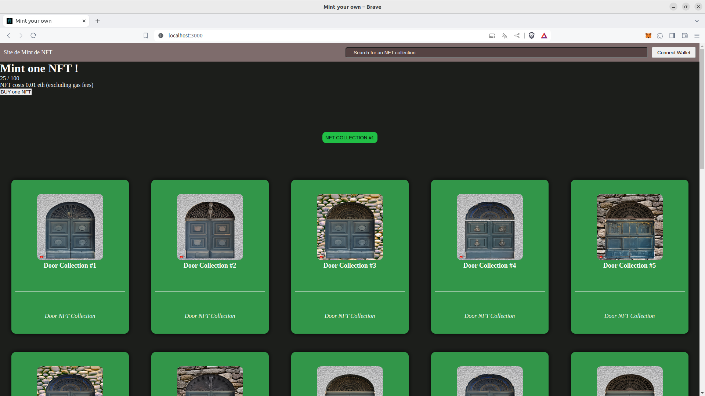

 # Site de Mint de NFT associé a la Blockchain Mumbai

### Descriptif
_______
Création d'une collection de NFT grâce à <a href="https://github.com/HashLips/hashlips_art_engine">hashlips_art_engine</a>. Les images ainsi que les fichiers `.json` générés sont hébergés sur <a href="https://www.pinata.cloud">pinata</a> nous permettant d'avoir les liens IPFS afin de connecter ces données au SmartContract.<br>
Avec ces données, nous avons associé un site pour afficher et minter la collection de NFT.

Le projet a été réalisé dans un temps limité et n'est malheureusement pas aboutie.

### Fonctionnalités du site internet
_______
- **Connexion du wallet**: Vous pouvez connecter votre wallet au site.
- **Affichage de la collection**: Affiche toutes les NFTs de la collection.
- **Mint d'un NFT**: Possibilité de minter un NFT.
- **Affichage du nombre de NFT déja minté dans la collection**

### Image
_______


### Usage
_______
```sh
npm start
```

### Dependance
_______
Le smart contract est en `solidity` et a été déployer via <a href="https://remix.ethereum.org">Remix - Ethereum IDE</a>.
Le site xeb utilise les languages/librairies suivantes : `React`, `HTML` et `SCSS`.

### Authors
_______
+ Agustin GUILLEN
+ Nicolas LEGAY
+ Fabien OLIVIER

