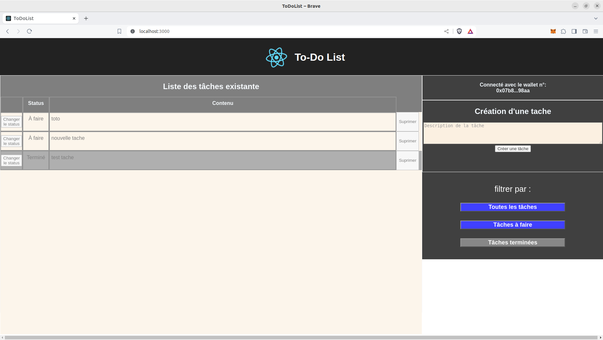

 # TodoList Blockchain (Mumbai)

### Descriptif
_______
Application TodoList connecté à la blockchain de test `Mumbai`. Cette application permet de gérer vos tâches à l'aide de la technologie blockchain. Chaque modification de tâche est enregistrée de manière immuable sur la blockchain Mumbai, assurant ainsi un historique transparent et sécurisé

### Fonctionnalités
_______
- **Création de Tâches**: Ajoutez des tâches à votre liste en spécifiant le titre, la description et la date limite.
- **Filtre des Tâches**: Affiche les taches en fonction de leurs statut (en cours ou terminée).
- **Changement de statut des Tâches**: Changer le statut d'une tâche (en cours à terminée, etc.).
- **Suppression des Tâches**: Supprimer une tâche quel soit en cours ou terminée.

### Image
_______


### Usage
_______
```go
npm install
npm start
```

### Dependance
_______
Utilisation des languages/librairies suivantes : `React`, `HTML` et `CSS`

### Authors
_______
+ Fabien OLIVIER